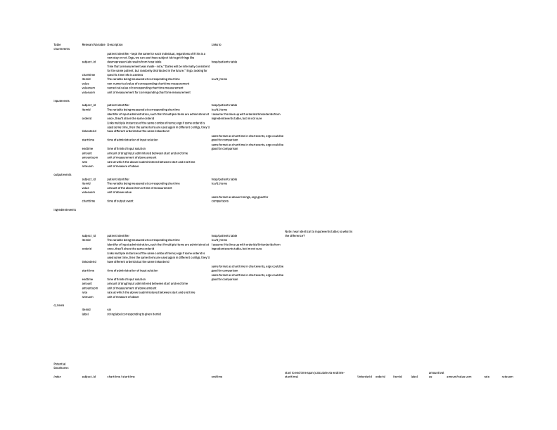

# Filtered Analysis

### Filter icu dataset for hyponatremic patients by using command ```make build_hn_dataset ```
### Remove all files / conda environments with command ```make clean```


This directory contains tools for filtering the mimic iv icu dataset (specifically, this is built for the demo dataset, but the full dataset will work just as well.)

To run this, clone this repo to your machine and use command ```make build_hn_dataset ``` in the terminal. This will do the following:
1. Download the icu dataset
2. Filter the icu/chartevents csv for hyponatremic patients
3. Return a list of those patient ids
4. Use those patient ids to build filtered dataframes from the input, output, ingredients, and chartevents dataframes
5. Collate like variables from each of these and build one master dataframe of hyponatremic patients, found in filtered_data directory

Below is the scratch work I did through reading the mimic iv docs to pick out important variables for this master dataset:




I more or less kept the same format as the potential dataframe found at the bottom of that image, but I didn't implement the time span column.
