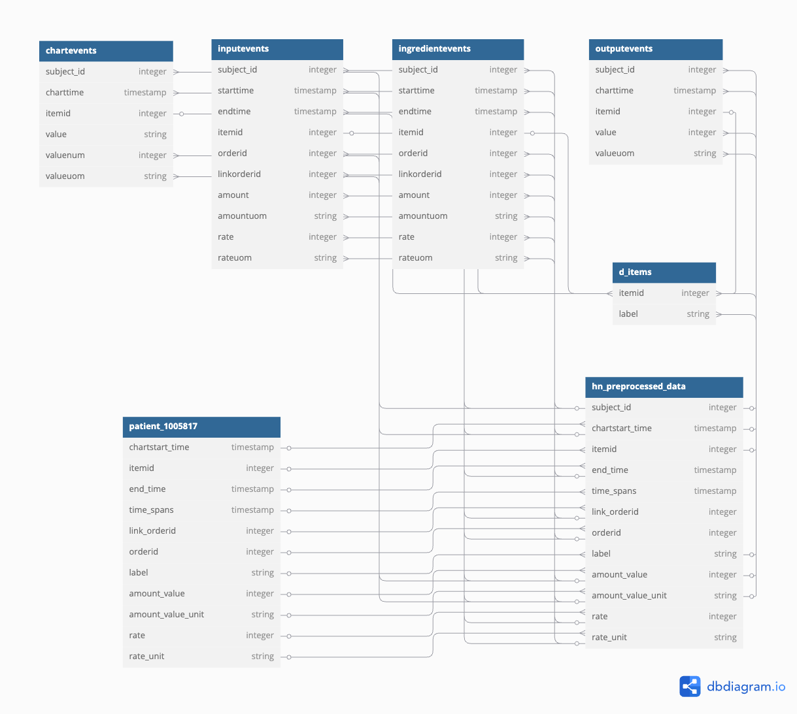

# Filtered Analysis
# TLDR:
##  Step1:
### Download and filter sample icu dataset for hyponatremic patients by using command ```make build_hn_dataset ```
## Step 2:
### Build patient specific datasets by using command ```make build_patient_dataset SUBJECT_ID=1005817``` 
## Step 3:
### Remove all files / conda environments with command ```make clean```


This directory contains tools for filtering the mimic iv icu dataset (specifically, this is built for the demo dataset, but the full dataset will work just as well.)

Demo dataset found here:
[MIMIC-IV Clinical Database Demo](https://physionet.org/content/mimic-iv-demo/2.2/#files-panel)

Full dataset found here:
[MIMIC-IV](https://physionet.org/content/mimiciv/3.1/)
(Note: Credentialed Access Required)

Below are further details on how this works, as well a list of other subject_ids to build patient specific datasets from this demo database.

## Purpose and Organization of this Pre-Processing

The motivations behind pre-processing the ICU dataset for further analysis is as follows:
1. Patient information is split between multiple datasets in the overall ICU dataset; this can lead to analysis-based headaches, since you have to keep switching from one to another, and it would be nice to have some standard master dataset to pull from.
2. These disparate datasets sometimes use different column titles for the same idea (ie, amount vs variable), making analysis of the same concept from dataset to dataset a pain. 
3. Individual datasets also contain various columns that may not be necessary for the dataset validation/model training we are aiming for, such as information on the provider logging the data.
4. Finally, hyponatremic patients make up a small subset of the overall dataset, and so pulling this subset out makes for less computational overhead when running analyses (or it would if I wasn't brute forcing the dataset creation LOL but thats for next semester's students to fix)

For these reasons, it's helpful to pre-process our big ICU dataset into a standardized hyponatremia specific dataset. Even better, by using Panda's heirarchical indexing funcitonality we can easily pull out ALL of the data for a given hyponatremia patient, without having to wade through multiple different datasets.

Linked in the img directory is a pdf with the scratch work/research I did through the mimic iv docs to figure out which variables were related and how they linked together, which is what informed the structure of the master filtered dataset.

And here is a yucky diagram showing the interconnected-ness of these disparate dataset to the master dataset, and how that feeds the individual patient datasets:




## Filtering ICU Dataset for Hyponatremic Patients

To build a dataset of hyponatremic patients, clone this repo to your machine and use command ```make build_hn_dataset ``` in the terminal. This will do the following:
1. Download the icu dataset
2. Filter the icu/chartevents csv for hyponatremic patients
3. Return a list of those patient ids
4. Use those patient ids to build filtered dataframes from the input, output, ingredients, and chartevents dataframes
5. Collate like variables from each of these and build one master dataframe of hyponatremic patients, found in filtered_data directory

## Creating Patient Specific Datasets
You can then use the command ```make build_patient_dataset SUBJECT_ID=1005817``` to build a dataframe for a specific patient. Note, any valid subject_id will work, below is a list of all hyponatremic subject_ids from this demo datset that you can try:
```
10005817, 10027445, 10005348, 10020740, 10006053, 10007058, 10037928,
10038999, 10009628, 10016742, 10039708, 10026255, 10019385, 10023239,
10015931, 10022041, 10026406, 10021487, 10009035, 10014354, 10023771,
10029291, 10012853, 10001217, 10002428, 10002930, 10036156, 10015860,
10038081, 10016810, 10031404, 10022880, 10006580, 10010867, 10039997,
10037975, 10011398, 10021118, 10018501, 10035185, 10004457, 10013049,
10020306, 10018081, 10035631, 10021938, 10004422, 10029484, 10020944,
10019777, 10004720, 10040025, 10017492, 10038933, 10001725, 10039831,
10031757, 10003400, 10032725, 10015272, 10014729, 10019917, 10009049,
10002495, 10008454, 10020187, 10026354, 10010471, 10038992, 10007818,
10022281, 10004733, 10008287, 10014078, 10020786, 10007928, 10019568,
10005909, 10027602, 10018423, 10019172, 10019003, 10018845, 10000032,
10025463, 10022017, 10007795, 10012552, 10003046, 10025612, 10004235,
10023117, 10037861, 10018328, 10024043, 10021312, 10005866, 10020640,
10021666 
```

Ergo, ``make build_patient_dataset SUBJECT_ID=10027445`` will create patient 10027445's unique dataset and etc etc for other subject_id values.

Note: I generated this list in the ```patient_stats_scratchwork.py``` script, if you'd like to see where it came from.

